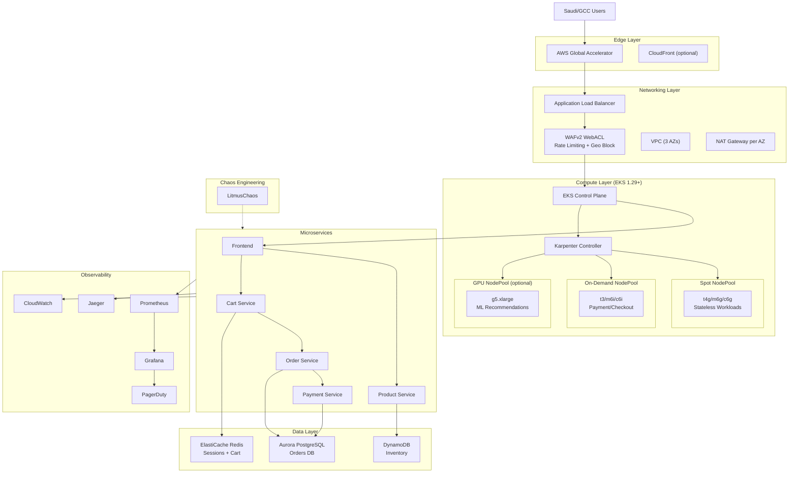

# White Friday Auto-Scaling E-Commerce Platform

## Table of Contents

1. [What is this Project?](#what-is-this-project)
2. [Why This Project Exists](#why-this-project-exists)
3. [Who Should Use This](#who-should-use-this)
4. [When to Use This](#when-to-use-this)
5. [Architecture Overview](#architecture-overview)
6. [White Friday Scaling Strategy](#white-friday-scaling-strategy)
7. [Project Structure](#project-structure)
8. [Getting Started](#getting-started)
9. [Multi-Arch & Graviton3 Guide](#multi-arch--graviton3-guide)
10. [Load Testing Methodology](#load-testing-methodology)
11. [Auto-Rollback Mechanics](#auto-rollback-mechanics)
12. [Chaos Engineering Playbook](#chaos-engineering-playbook)
13. [FinOps & Cost Dashboard](#finops--cost-dashboard)
14. [Observability Guide](#observability-guide)
15. [SRE Golden Signals](#sre-golden-signals)
16. [Troubleshooting](#troubleshooting)
17. [Performance Tuning](#performance-tuning)
18. [Roadmap](#roadmap)
19. [Security & Compliance](#security--compliance)
20. [Contributing](#contributing)
21. [License](#license)

---

## What is this Project?

This project is a **production-ready, enterprise-grade AWS infrastructure blueprint** designed for high-velocity e-commerce platforms operating at the scale of Noon, Amazon.sa, Jarir, and Extra Store. It simulates a complete e-commerce ecosystem that must handle the explosive traffic surges characteristic of "White Friday" (the Middle East's equivalent of Black Friday), scaling from **10 to 10,000 pods in under 2 minutes**.

The platform includes:

- **Terraform modules** for VPC, EKS with Karpenter, databases, security, CI/CD, observability, load testing, chaos engineering, and FinOps
- **Kubernetes manifests** for Karpenter NodePools, HPA configurations, NetworkPolicies, and PodDisruptionBudgets
- **Sample microservices** (frontend, product, cart, order, payment) built with Node.js/Express
- **Load testing suites** using k6 and Locust for distributed high-concurrency simulation
- **Chaos engineering experiments** using LitmusChaos for resilience validation
- **Grafana dashboards** provisioned for cost, performance, scaling velocity, and SLO monitoring
- **GitLab CI pipeline** with matrix builds, SAST, container scanning, automated load tests, and cost gates

**Every value is driven from `terraform.tfvars` and environment-specific `.tfvars` files.** No hardcoded values exist in modules.

---

## Why This Project Exists

Saudi and GCC e-commerce platforms face unique technical challenges:

1. **Massive traffic spikes**: White Friday can drive 50-100x normal traffic within minutes
2. **Cost sensitivity**: Infrastructure spend must be optimized while maintaining 99.9% availability
3. **Geographic constraints**: Primary traffic from KSA, UAE, Bahrain, Kuwait, and Egypt
4. **Multi-architecture needs**: Graviton3 (ARM64) instances reduce compute costs by 20-40%
5. **Regulatory requirements**: Data residency, encryption, and geo-blocking mandates
6. **Resilience expectations**: Payment flows cannot fail; cart abandonment costs millions

Traditional Cluster Autoscaler is too slow for these velocity requirements. This project replaces it entirely with **Karpenter v0.34+**, leveraging consolidation, spot/on-demand mixing, and over-provisioning to achieve sub-2-minute scale-ups.

---

## Who Should Use This

This project is designed for:

- **Principal Cloud Architects** designing greenfield e-commerce platforms in AWS
- **SREs** building auto-scaling, self-healing production systems
- **Platform Engineers** standardizing infrastructure-as-code across dev/staging/prod
- **DevOps Engineers** implementing GitOps, CI/CD, and automated rollbacks
- **Interview candidates** demonstrating production-grade Terraform, Kubernetes, and AWS expertise
- **Startups** in MENA preparing for seasonal traffic events

**Prerequisites:**

- Terraform ~> 1.7
- AWS CLI configured with appropriate permissions
- kubectl
- Docker with Buildx (for multi-arch builds)
- GitLab CI or ability to adapt to GitHub Actions

---

## When to Use This

Use this project when:

- You need to **prove infrastructure can scale** from 10 to 10,000 pods rapidly
- You are **preparing for seasonal events** (White Friday, Ramadan, National Day sales)
- You want to **standardize** modular Terraform across multiple environments
- You need **cost visibility** via Infracost integration and anomaly detection
- You must **validate resilience** via chaos engineering before production
- You want a **recruiter-ready portfolio project** demonstrating enterprise SRE skills

---

## Architecture Overview



**Traffic Flow:**

1. Users from KSA/UAE/BH/KW/EG hit **AWS Global Accelerator** for low-latency edge routing
2. Traffic terminates at **Application Load Balancer** with **WAFv2** protection
3. **Karpenter** provisions nodes on-demand based on pending pod requirements
4. Pods run on **Spot** (stateless) or **On-Demand** (critical payment/checkout) nodes
5. Services communicate via explicit **NetworkPolicies**
6. Data persists in **Aurora PostgreSQL**, **ElastiCache Redis**, and **DynamoDB**
7. All metrics flow to **Prometheus/Grafana** with **PagerDuty** alerting

---

## White Friday Scaling Strategy

The core challenge: **Scale from 10 to 10,000 pods in under 2 minutes.**

### How We Achieve This

| Mechanism | Purpose | Time Impact |
|-----------|---------|-------------|
| **Over-provisioning (Pause Pods)** | Maintain warm nodes ready for immediate scheduling | Eliminates node provisioning time |
| **Karpenter NodePools** | Direct EC2 provisioning without node group abstraction | ~30-45 seconds vs 3-5 minutes for CAS |
| **HPA Aggressive ScaleUp** | 100 pods per 15 seconds, stabilizationWindow=0 | Immediate pod creation |
| **Spot + On-Demand Mix** | Spot for stateless (cheap/fast), On-Demand for critical | Parallel capacity acquisition |
| **VPC Endpoints** | Eliminate NAT latency for ECR/CloudWatch | Faster image pull and metric push |
| **Graviton3 (ARM64)** | Higher core density, lower cost, faster boot | Improved packing efficiency |

### Scaling Sequence

```
Traffic Spike Detected (RPS > threshold)
         |
         v
HPA triggers pod creation (100 pods / 15s)
         |
         v
Karpenter sees pending pods
         |
         v
Over-provisioned pause pods evicted (low priority)
         |
         v
New pods scheduled on warm nodes (< 15s)
         |
         v
If warm nodes insufficient:
  Karpenter launches EC2 instances (30-45s)
  AMI cached via ECR VPC Endpoint
  Containerd pulls images
         |
         v
Pods ready, traffic served
```

### Key Configurations

- **HPA `scaleUp.stabilizationWindowSeconds: 0`**: No delay on scale-up
- **HPA `scaleDown.stabilizationWindowSeconds: 300`**: 5-minute cooldown prevents flapping
- **Karpenter `consolidationPolicy: WhenUnderutilized`**: Continuously packs pods for efficiency
- **Pause pods with `PriorityClass` value -1**: First to be evicted when real workloads arrive

---

## Project Structure

```
white-friday-autoscale/
├── README.md                          # This file
├── Makefile                           # Standardized commands
├── .gitlab-ci.yml                     # GitLab CI pipeline
├── terraform/
│   ├── backend.tf                     # S3 + DynamoDB remote state
│   ├── providers.tf                   # AWS, Helm, K8s, GitLab providers
│   ├── variables.tf                   # Global variables with validation
│   ├── data.tf                        # Data sources
│   ├── main.tf                        # Module orchestrator
│   ├── terraform.tfvars               # Default variable values
│   ├── environments/
│   │   ├── dev.tfvars
│   │   ├── staging.tfvars
│   │   └── prod.tfvars
│   └── modules/
│       ├── networking/                # VPC, subnets, NAT, ALB, Global Accelerator
│       ├── eks_karpenter/             # EKS 1.29+, Karpenter v0.34+, NO Cluster Autoscaler
│       ├── autoscaling/               # HPA, VPA, over-provisioning, CPA
│       ├── security/                  # WAFv2, Shield, KMS, Security Groups
│       ├── database/                  # Aurora, ElastiCache Redis, DynamoDB
│       ├── cicd_infra/                # GitLab Runner, ECR, IRSA, multi-arch
│       ├── loadtesting/               # k6 operator, Locust, resource quotas
│       ├── chaos/                     # Litmus operator, experiments
│       ├── observability/             # Prometheus, Grafana, Jaeger, CW
│       └── finops/                    # Budgets, anomaly detection, tagging
├── kubernetes/
│   ├── karpenter/                     # NodePool + EC2NodeClass manifests
│   ├── hpa/                           # HPA YAMLs with behavior blocks
│   ├── k6-tests/                      # k6 JavaScript test scripts + CRD
│   ├── locust/                        # Locust Python tasks
│   ├── litmus/                        # ChaosExperiment CRDs with probes
│   ├── grafana-dashboards/            # JSON dashboards
│   └── microservices/                 # Sample e-commerce app
│       ├── frontend/
│       ├── product-service/
│       ├── cart-service/
│       ├── order-service/
│       ├── payment-service/
│       ├── docker-compose.yml
│       └── prometheus.yml
├── policies/
│   ├── waf-rules/                     # WAF rule JSONs
│   ├── iam-policies/                  # IRSA policies per service
│   └── karpenter-node-policies/       # Node IAM policy
├── scripts/
│   ├── bootstrap-backend.sh           # Idempotent S3 + DynamoDB creation
│   ├── pre-flight-checks.sh           # AWS creds, quotas, permissions
│   ├── run-load-test.sh               # k6/Locust trigger + latency gate
│   ├── chaos-scheduler.sh             # Litmus with safety abort
│   └── rollback.sh                    # SLO-based automated rollback
└── infracost/
    ├── infracost.yml                  # Usage-based cost config
    ├── usage.tfvars                   # Mock usage for estimates
    └── cost-policy.rego               # PR cost gate policy
```

---

## Getting Started

### 1. Prerequisites

```bash
# Install required tools
brew install terraform kubectl helm awscli docker jq infracost tflint checkov

# Configure AWS credentials
aws configure

# Verify
aws sts get-caller-identity
```

### 2. Clone and Configure

```bash
git clone https://github.com/your-org/white-friday-autoscale.git
cd white-friday-autoscale
```

### 3. Bootstrap Backend

```bash
export PROJECT_NAME=whitefriday
export AWS_REGION=eu-west-1
make bootstrap
```

### 4. Edit Variables

Open `terraform/terraform.tfvars` and environment files:

```bash
# Edit default values
vim terraform/terraform.tfvars

# Edit environment-specific overrides
vim terraform/environments/dev.tfvars
vim terraform/environments/staging.tfvars
vim terraform/environments/prod.tfvars
```

**Required changes:**

- `common_tags`: Update `Owner` and `CostCenter`
- `gitlab_url`: Your GitLab instance
- `runner_token_secret_arn`: ARN of Secrets Manager secret with runner token
- `pagerduty_service_key`: Your PagerDuty integration key

### 5. Generate Terraform Lock File

After the first `terraform init`, commit the generated lock file:

```bash
cd terraform
terraform init
# Review provider versions in .terraform.lock.hcl
git add .terraform.lock.hcl
git commit -m "chore: add Terraform provider lock file"
```

**Lock File Notes:**
- `.terraform.lock.hcl` ensures all team members use identical provider versions
- It is generated automatically by `terraform init` when missing
- Commit this file to version control for reproducible builds
- Use `terraform init -upgrade` to update provider versions and regenerate the lock file
- The lock file includes SHA256 hashes for provider packages, protecting against supply-chain attacks

### 6. Pre-flight Checks

```bash
export ENVIRONMENT=dev
make preflight
```

### 7. Deploy

```bash
# Initialize
make init ENVIRONMENT=dev

# Plan
make plan ENVIRONMENT=dev

# Apply
make apply ENVIRONMENT=dev
```

### 8. Validate

```bash
# Check cluster
aws eks update-kubeconfig --region eu-west-1 --name whitefriday-dev
kubectl get nodes

# Check Karpenter
kubectl logs -n karpenter -l app.kubernetes.io/name=karpenter

# Check HPA
kubectl get hpa
```

---

## Multi-Arch & Graviton3 Guide

### Why Graviton3?

- **20-40% better price/performance** vs x86 equivalents
- **Higher core density** = more pods per node
- **Faster memory bandwidth** for in-memory caches
- **AWS-native** = best integration with EKS, Karpenter, and VPC Endpoints

### How Multi-Arch Builds Work

The GitLab CI uses **matrix builds**:

```yaml
parallel:
  matrix:
    - ARCH: [amd64, arm64]
      NODE: [c6i, c7g]
```

1. Each microservice is built for `linux/amd64` and `linux/arm64`
2. Images pushed to ECR with architecture-specific tags
3. `docker manifest create` combines them into a single multi-arch manifest
4. Karpenter NodePools include both architectures; Kubernetes scheduler selects appropriate nodes

### Verifying Pod Architecture Distribution

```bash
# Check node architectures
kubectl get nodes -L kubernetes.io/arch,node.kubernetes.io/instance-type

# Check pod node assignment
kubectl get pods -o wide -n default

# Verify image manifest
docker manifest inspect ${ECR_REPO}/frontend:latest
```

### Container Tuning for Graviton3

- **Node.js**: Use ARM64-compatible base images (`node:20-alpine` supports both)
- **JVM**: Add `-XX:+UseContainerSupport` and appropriate heap sizing
- **CPU limits vs requests**: Set limits 2x requests for burstable performance
- **Avoid architecture-specific binaries**: Use pure JavaScript/Python or cross-compile Go/Rust

---

## Load Testing Methodology

### k6: Primary Load Tool

**Why k6?**

- Native Kubernetes operator support
- Distributed execution across 10+ pods
- Prometheus remote-write integration
- Thresholds defined in code

**Test Scenarios:**

1. **Homepage Load**: Validates CDN/ALB latency
2. **Product Search**: Tests DynamoDB query performance
3. **View Product**: Validates cache hit rates
4. **Add to Cart**: Tests Redis write consistency
5. **Checkout Flow**: End-to-end order creation (Aurora)
6. **Payment Callback**: Validates idempotency and webhook handling

**The 200ms Latency Gate:**

```javascript
thresholds: {
  http_req_duration: ['p(95)<200'],
  http_req_failed: ['rate<0.001'],
}
```

If `p(95) > 200ms` OR `error_rate > 0.1%`, the pipeline **fails and triggers rollback**.

### Locust: Secondary Tool

**Why Locust?**

- Complex user journey modeling in Python
- Master-worker distributed mode
- Real-time Web UI for monitoring
- `FastHttpUser` for high concurrency

**Usage:**

```bash
cd kubernetes/locust
locust -f locustfile.py --host=https://staging.whitefriday.example.com
```

### Interpreting Results

| Metric | Healthy | Warning | Critical |
|--------|---------|---------|----------|
| p(50) latency | < 50ms | 50-100ms | > 100ms |
| p(95) latency | < 200ms | 200-500ms | > 500ms |
| p(99) latency | < 500ms | 500-1000ms | > 1000ms |
| Error rate | < 0.01% | 0.01-0.1% | > 0.1% |
| RPS per pod | > 1000 | 500-1000 | < 500 |

---

## Auto-Rollback Mechanics

### Triggers

Rollback is automatically triggered when:

1. **Load test fails**: `p(95) > 200ms` or `error_rate > 0.1%`
2. **SLO breach detected**: Availability < 99.9% for > 2 minutes
3. **Chaos test failure**: Error rate > 5% during experiment
4. **Manual pipeline trigger**: Emergency revert button in GitLab

### Rollback Process

```bash
# 1. Prometheus queries current SLOs
availability = 1 - sum(rate(http_5xx[5m])) / sum(rate(http_total[5m]))
p95_latency = histogram_quantile(0.95, rate(http_duration_bucket[5m]))

# 2. If SLO breached, rollback script executes:
for service in frontend product-service cart-service order-service payment-service; do
  # Prefer ArgoCD rollback
  argocd app rollback $service 0
  
  # Fallback to kubectl
  kubectl rollout undo deployment/$service
  
  # Wait for stabilization
  kubectl rollout status deployment/$service --timeout=300s
done

# 3. Verify recovery
# Re-run health checks and Prometheus queries
```

### GitLab CI Integration

The `.gitlab-ci.yml` includes a `rollback` job that runs `when: on_failure`:

```yaml
rollback:
  stage: deploy-prod
  when: on_failure
  script:
    - bash scripts/rollback.sh
```

---

## Chaos Engineering Playbook

### Experiments

| Experiment | Target | Frequency | Safety Abort |
|------------|--------|-----------|--------------|
| **Pod Delete** | Cart Service | Every 10 min (staging) | Error rate > 5% |
| **Network Latency** | Payment -> RDS | 500ms injection | p95 latency > 2s |
| **Zone Down** | One AZ blocked | Scheduled nightly | Availability < 99% |
| **Pod CPU Hog** | All services | Stress test HPA | Error rate > 5% |

### Running Experiments Manually

```bash
# Ensure you're targeting staging
export ENVIRONMENT=staging
aws eks update-kubeconfig --region eu-west-1 --name whitefriday-staging

# Run chaos scheduler with safety checks
make chaos

# Or apply experiments directly
kubectl apply -f kubernetes/litmus/pod-delete.yaml -n litmus
kubectl apply -f kubernetes/litmus/network-latency.yaml -n litmus
```

### Interpreting Resilience Scores

A resilience score is calculated as:

```
Score = (availability_during_chaos * 0.4) + 
        (1 - normalized_latency_increase * 0.3) + 
        (recovery_time_seconds < 60 ? 1 : 60/recovery_time_seconds * 0.3)
```

| Score | Rating |
|-------|--------|
| 0.95 - 1.00 | Excellent |
| 0.80 - 0.94 | Good |
| 0.60 - 0.79 | Fair |
| < 0.60 | Needs Improvement |

### Probes for Recovery Verification

Each Litmus experiment includes a **Prometheus probe**:

```yaml
probe:
  - name: "check-cart-service-health"
    type: "promProbe"
    mode: "Continuous"
    promProbe/inputs:
      endpoint: "http://prometheus:9090"
      query: |
        sum(rate(http_requests_total{service="cart-service",status=~"5.."}[1m])) 
        / sum(rate(http_requests_total{service="cart-service"}[1m]))
      comparator:
        criteria: "<"
        value: "0.05"
```

---

## FinOps & Cost Dashboard

### Cost per 1000 Transactions

This custom metric combines AWS Cost Explorer API data with application transaction counts:

```promql
(aws_billing_estimated_charges 
  / on() group_left() 
  (sum(rate(http_requests_total[1h])) * 3600 / 1000))
```

**Interpretation:**

- Target: <$0.50 per 1K transactions during normal operations
- White Friday target: <$1.00 per 1K transactions at peak

### Infracost PR Comments

Every merge request receives an Infracost comment:

```
This change will cost +$342/month
- +$200 EC2 (Karpenter nodes)
- +$100 RDS Aurora (increased capacity)
- +$42 ElastiCache Redis
```

**Cost Policy:** If cost increase > $500/month without `cost-approved` label, the pipeline fails.

### AWS Budgets

Monthly budget alarms:

- **80%**: Email warning to SRE team
- **100%**: Email alert to SRE + Finance
- **120%**: PagerDuty incident triggered

### Tagging Governance

Mandatory tags enforced via AWS Config rules:

| Tag | Purpose |
|-----|---------|
| `Environment` | Cost allocation by env |
| `Team` | Ownership attribution |
| `CostCenter` | Financial reporting |
| `Project` | Program-level tracking |
| `Owner` | Escalation contact |

---

## Observability Guide

### Accessing Dashboards

After deployment, access Grafana:

```bash
kubectl port-forward -n monitoring svc/kube-prometheus-stack-grafana 8080:80
# Open http://localhost:8080
# Default credentials in AWS Secrets Manager: whitefriday/grafana-admin-password
```

### Key Dashboards

| Dashboard | URL Path | Purpose |
|-----------|----------|---------|
| Cost per 1K Transactions | `/d/cost` | FinOps tracking |
| RPS by Microservice | `/d/rps` | Traffic distribution |
| Pod Scaling Velocity | `/d/scale` | Scale-up timing analysis |
| White Friday SLO | `/d/slo` | Error budget + availability |
| Karpenter Efficiency | `/d/karpenter` | Spot vs On-Demand ratio |

### Key Metrics During Scaling Events

Watch these Prometheus queries:

```promql
# 1. Pending pods (should drop to 0 within 2 minutes)
sum(kube_pod_status_phase{phase="Pending"})

# 2. Node ready count
sum(kube_node_status_condition{condition="Ready",status="true"})

# 3. HPA current vs desired replicas
kube_horizontalpodautoscaler_status_current_replicas
kube_horizontalpodautoscaler_status_desired_replicas

# 4. Karpenter node creation latency
histogram_quantile(0.99, sum(rate(karpenter_nodes_created[5m])) by (le))

# 5. Spot vs On-Demand distribution
sum by (capacity_type) (karpenter_nodes_total)
```

### PagerDuty Escalation

| Severity | Condition | Response Time |
|----------|-----------|---------------|
| P1 | Availability < 99% | 5 minutes |
| P2 | p95 latency > 500ms | 15 minutes |
| P3 | Error rate > 1% | 30 minutes |
| P4 | Cost anomaly > 150% | 1 hour |

---

## SRE Golden Signals

| Signal | Metric | Location |
|--------|--------|----------|
| **Latency** | `http_request_duration_seconds` | Prometheus + Grafana |
| **Traffic** | `http_requests_total` | Prometheus + CloudWatch |
| **Errors** | `http_requests_total{status=~"5.."}` | Prometheus + PagerDuty |
| **Saturation** | `kube_node_status_capacity` / `container_cpu_usage_seconds_total` | Prometheus + Container Insights |

---

## Troubleshooting

### Karpenter Not Provisioning Nodes

**Symptoms:** Pods stuck in `Pending`, no new nodes created.

**Checks:**

```bash
# 1. Check Karpenter logs
kubectl logs -n karpenter -l app.kubernetes.io/name=karpenter --tail=100

# 2. Verify NodePool requirements
kubectl get nodepool spot-general -o yaml
kubectl get nodepool on-demand-critical -o yaml

# 3. Check EC2 quotas
aws service-quotas get-service-quota --service-code ec2 --quota-code L-1216C47A

# 4. Verify IAM role
aws iam get-role --role-name whitefriday-karpenter-node

# 5. Check subnet tags
kubectl get ec2nodeclass default -o yaml
```

**Common Fixes:**

- Missing `karpenter.sh/discovery` tags on subnets/security groups
- EC2 vCPU quota exhausted
- Karpenter controller IAM role missing `ec2:RunInstances`

### HPA Flapping

**Symptoms:** Replicas oscillate rapidly.

**Fixes:**

- Increase `scaleDown.stabilizationWindowSeconds` (default: 300s)
- Verify Metrics Server is running: `kubectl get deployment metrics-server -n kube-system`
- Check if target RPS metric is noisy; increase smoothing window
- Ensure CPU limits are set (not just requests)

### Load Test False Positives

**Symptoms:** k6 reports high latency, but application metrics look fine.

**Checks:**

```bash
# 1. Check k6 runner resource exhaustion
kubectl top pods -n loadtesting

# 2. Verify k6 runner has enough CPU/memory
kubectl get pods -n loadtesting -o yaml | grep resources -A 10

# 3. Check network policy isn't blocking egress
kubectl get networkpolicy -n loadtesting
```

### Multi-Arch Image Pull Failures

**Symptoms:** `ErrImagePull` on ARM64 nodes.

**Fixes:**

```bash
# Verify manifest includes arm64
docker manifest inspect ${ECR_REPO}/frontend:latest

# Check node selector doesn't force amd64
kubectl get deployment frontend -o yaml | grep nodeSelector -A 5

# Rebuild with Buildx for both architectures
docker buildx build --platform linux/amd64,linux/arm64 --push .
```

---

## Performance Tuning

### JVM Containers (if applicable)

```bash
-XX:+UseContainerSupport
-XX:MaxRAMPercentage=75.0
-XX:InitialRAMPercentage=50.0
```

### Node.js Containers

```bash
# Use UV_THREADPOOL_SIZE for crypto-heavy operations
UV_THREADPOOL_SIZE=128

# Enable clustering for multi-core utilization
NODE_OPTIONS="--max-old-space-size=4096"
```

### CPU Limits vs Requests

| Workload Type | Request | Limit | Rationale |
|--------------|---------|-------|-----------|
| Frontend | 250m | 500m | Burstable, I/O bound |
| Product Service | 500m | 1000m | CPU-bound search |
| Cart Service | 250m | 500m | Redis I/O bound |
| Order Service | 500m | 1000m | DB transaction heavy |
| Payment Service | 500m | 1000m | Crypto + validation |

### Vertical Pod Autoscaler Recommendations

VPA runs in **"Off" mode** in staging to generate recommendations without applying them:

```bash
kubectl get vpa -n kube-system
# Review recommendations and manually adjust requests/limits
```

---

## Roadmap

| Quarter | Feature | Status |
|---------|---------|--------|
| Q1 2024 | AWS Fargate burst capacity for Karpenter | Planned |
| Q1 2024 | KEDA for event-driven scaling (SQS/Kafka) | Planned |
| Q2 2024 | Predictive scaling based on historical White Friday data | Planned |
| Q2 2024 | AWS Inferentia for ML recommendation engine | Research |
| Q3 2024 | Multi-region active-active (me-central-1 + eu-west-1) | Planned |
| Q3 2024 | GitOps migration to ArgoCD with ApplicationSets | Planned |
| Q4 2024 | FinOps: Reserved Instance and Savings Plan automation | Planned |

---

## Security & Compliance

### Encryption

| Layer | Method | Key Management |
|-------|--------|----------------|
| EBS volumes | KMS CMK | AWS-managed + customer-managed |
| RDS Aurora | KMS CMK envelope encryption | `aws_kms_key.main` |
| ElastiCache Redis | Encryption in transit + at rest | Auth token in Secrets Manager |
| S3 buckets | AES-256 / KMS | Bucket default encryption |
| EKS secrets | KMS envelope encryption | `aws_kms_key.eks` |

### Secrets Management

- **Never commit secrets** to Git
- All sensitive values stored in **AWS Secrets Manager**
- Automatic rotation enabled for RDS credentials
- IRSA used for pod-level access; no long-term AWS keys

### Network Security

- **Default-deny NetworkPolicies** in all namespaces
- Explicit allow rules between known services only
- WAFv2 geo-blocking restricts traffic to GCC + Egypt
- AWS Shield Advanced for DDoS protection in production
- Security Groups use least-privilege; no `0.0.0.0/0` except ALB 443

---

## Contributing

1. Fork the repository
2. Create a feature branch (`git checkout -b feature/amazing-feature`)
3. Commit changes (`git commit -m 'Add amazing feature'`)
4. Push to branch (`git push origin feature/amazing-feature`)
5. Open a Merge Request

**Pre-commit checks:**

```bash
make validate  # Terraform validate + fmt
make test      # Unit tests
make lint      # tflint + checkov
```

---

## License

This project is licensed under the MIT License. See [LICENSE](LICENSE) for details.

---

## Acknowledgments

- **Karpenter** team for the revolutionary node provisioning approach
- **AWS** for Graviton3 and EKS innovations
- **Grafana Labs** for k6 and the observability stack
- **LitmusChaos** community for cloud-native chaos engineering

---

**Built for scale. Tested with chaos. Ready for White Friday.**
