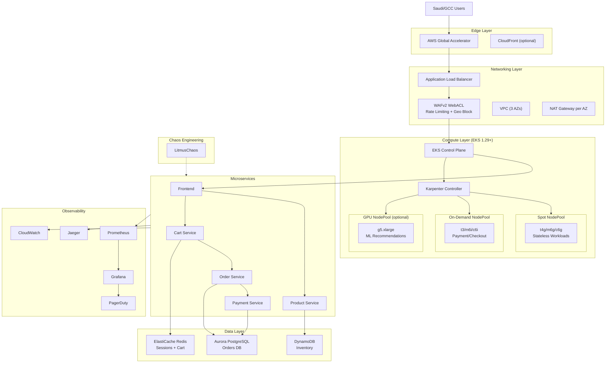

# White Friday ENGINE

---

## Table of Contents

1. [🚀 Quick Start — Just Change ONE File](#-quick-start--just-change-one-file)
2. [🤔 What Is This Project?](#-wtf-is-this-project)
3. [📖 Step-by-Step: What Happens When You Run This](#-step-by-step-what-happens-when-you-run-this)
4. [🔭 Behind the Scenes — Every Layer Explained](#-behind-the-scenes--every-layer-explained)
5. [What is this Project?](#what-is-this-project)
6. [Why This Project Exists](#why-this-project-exists)
7. [Who Should Use This](#who-should-use-this)
8. [When to Use This](#when-to-use-this)
9. [Architecture Overview](#architecture-overview)
10. [White Friday Scaling Strategy](#white-friday-scaling-strategy)
11. [Project Structure](#project-structure)
12. [Getting Started](#getting-started)
13. [Multi-Arch & Graviton3 Guide](#multi-arch--graviton3-guide)
14. [Load Testing Methodology](#load-testing-methodology)
15. [Auto-Rollback Mechanics](#auto-rollback-mechanics)
16. [Chaos Engineering Playbook](#chaos-engineering-playbook)
17. [FinOps & Cost Dashboard](#finops--cost-dashboard)
18. [Observability Guide](#observability-guide)
19. [SRE Golden Signals](#sre-golden-signals)
20. [Troubleshooting](#troubleshooting)
21. [Performance Tuning](#performance-tuning)
22. [Roadmap](#roadmap)
23. [Security & Compliance](#security--compliance)
24. [Contributing](#contributing)
25. [License](#license)

---

## 🚀 Quick Start — Just Change ONE File

> **You only ever need to touch a single file to make this entire project work for your setup.**

Open this file:

```
terraform/terraform.tfvars
```

Change these values to match your situation:

```hcl
# Your project name — used in naming every AWS resource
project_name = "whitefriday"

# Which environment you are deploying (dev / staging / prod)
environment = "dev"

# Which AWS region to deploy into
region = "eu-west-1"

# Your team's email + cost centre
common_tags = {
  Owner      = "your-email@example.com"
  CostCenter = "your-team"
}

# Your GitLab server URL (leave as-is if using gitlab.com)
gitlab_url = "https://gitlab.com"

# The AWS Secrets Manager ARN that holds your GitLab runner token
runner_token_secret_arn = "arn:aws:secretsmanager:eu-west-1:123456789:secret:..."

# Your PagerDuty integration key (for alerts)
pagerduty_service_key = "your-pagerduty-key"
```

That is it. Every other setting — database sizes, load test user counts, chaos experiments, scaling limits, WAF rules — is already in that file with sensible defaults. **You do not need to touch any other code file.**

For per-environment overrides (dev vs staging vs prod), edit:

```
terraform/environments/dev.tfvars
terraform/environments/staging.tfvars
terraform/environments/prod.tfvars
```

Then run:

```bash
make bootstrap          # one-time: creates S3 bucket + DynamoDB for state
make preflight          # checks your AWS account is ready
make apply ENVIRONMENT=dev
```

Done. Your entire cloud platform is live.

---

## 🤔 What Is This Project?

Imagine it is White Friday (the Middle East's Black Friday). Millions of people in Saudi Arabia, UAE, Kuwait, Bahrain, and Egypt all open their phones at midnight and start shopping at the same time on a website like Noon or Amazon.sa.

Normally the website has maybe 100 people shopping. Now suddenly 500,000 people hit it in 60 seconds.

**This project is the infrastructure that makes sure the website does not crash.**

It automatically:

1. **Detects** that traffic is exploding
2. **Spins up thousands of new servers** on Amazon Web Services — in under 2 minutes
3. **Routes all the new shoppers** to those servers
4. **Saves money** by using cheap "spot" servers when possible
5. **Watches everything** with charts and dashboards
6. **Fixes itself** if something breaks
7. **Shuts down the extra servers** after the sale ends, so you are not paying for capacity you don't need

Think of it like a rubber band website. On normal days it is small. On White Friday it stretches to 1,000× its size — automatically, in under 2 minutes — then snaps back when the sale is over.

**This project is the rubber band.**

---

## 📖 Step-by-Step: What Happens When You Run This

This section walks through the full story — from the moment you clone the repo to the moment a shopper in Riyadh successfully pays for a phone during White Friday. No jargon.

---

### Step 1 — You Clone the Repo and Open One File

```bash
git clone https://github.com/your-org/white-friday-autoscale.git
cd white-friday-autoscale
```

You open `terraform/terraform.tfvars`. This is the **only file you configure**. You set:

- Your AWS region (e.g., `eu-west-1`)
- Your project name
- Your email for alerts
- How big you want your database
- How many test users to simulate

Every other file in the project reads its settings from here. Nothing is hard-coded anywhere else.

---

### Step 2 — You Bootstrap the Backend

```bash
make bootstrap
```

**What happens behind the scenes:**

The script `scripts/bootstrap-backend.sh` runs and:

1. Creates an **S3 bucket** on AWS — this is like a Google Drive folder where Terraform saves its "memory" (what infrastructure already exists)
2. Creates a **DynamoDB table** — this is like a lock file; it prevents two people from running Terraform at the same time and breaking things
3. These two things together form the **Terraform remote state backend**

After this, every team member who runs Terraform sees the same state. Nobody overwrites each other.

---

### Step 3 — You Run Pre-Flight Checks

```bash
make preflight
```

**What happens behind the scenes:**

The script `scripts/pre-flight-checks.sh` runs and checks:

1. Are your AWS credentials configured? (`aws sts get-caller-identity`)
2. Does your AWS account have enough EC2 vCPU quota to run 10,000 pods?
3. Do you have the right IAM permissions to create EKS, VPCs, and databases?
4. Is your AWS region the one you set in `terraform.tfvars`?

If any check fails, it tells you exactly what to fix before you waste time deploying.

---

### Step 4 — Terraform Plans What It Will Build

```bash
make plan ENVIRONMENT=dev
```

**What happens behind the scenes:**

Terraform reads every `.tf` file in the `terraform/` folder, reads your `terraform.tfvars`, and calculates exactly what AWS resources it will create. It prints a list like:

```
+ aws_vpc.main              will be created
+ aws_eks_cluster.main      will be created
+ aws_rds_cluster.main      will be created
... (hundreds more)
```

Nothing is created yet. This is just the shopping list. You review it before anything is charged.

---

### Step 5 — Terraform Builds the Network

```bash
make apply ENVIRONMENT=dev
```

**First thing Terraform builds — the network:**

The `networking` module runs and creates:

1. **VPC (Virtual Private Cloud)** — Think of this as a private room inside AWS. Your servers live here. The outside internet cannot directly reach them.
2. **3 Availability Zones** — Your infrastructure is spread across 3 physical data centres. If one burns down, the other two keep running.
3. **Public Subnets** — The "front door" of the network. The Load Balancer sits here.
4. **Private Subnets** — The "back rooms." Your actual servers (EKS nodes, databases) sit here. The internet cannot reach them directly.
5. **NAT Gateways** — Private servers need to download software updates. NAT lets them talk outward to the internet, but the internet cannot talk inward to them.
6. **Application Load Balancer (ALB)** — The bouncer at the front door. It receives all incoming traffic and distributes it across your servers.
7. **AWS Global Accelerator** — Routes users from Saudi Arabia, UAE, etc. to the nearest AWS edge point for lower latency. Instead of traffic travelling all the way to Ireland, it hops onto the AWS fast lane at the nearest city.

---

### Step 6 — Terraform Builds the Kubernetes Cluster

The `eks_karpenter` module runs next:

1. **EKS (Elastic Kubernetes Service)** is created. This is the "brain" of the compute layer. Think of Kubernetes as an operating system for a fleet of servers. It decides which servers run which apps.
2. **Karpenter** is installed. This is the auto-scaling engine. Traditional Kubernetes autoscaling (Cluster Autoscaler) is slow — it takes 3–5 minutes to add new servers. Karpenter goes directly to AWS EC2 and launches new servers in 30–45 seconds.
3. **NodePools** are configured:
   - **Spot NodePool**: Cheap AWS spot instances (up to 90% off). Used for stateless services like the product catalogue and cart. If AWS needs the server back, Karpenter moves your pods elsewhere in seconds.
   - **On-Demand NodePool**: Regular full-price servers. Used for payment processing — you can never lose a payment to a spot interruption.
4. **Over-provisioning Pause Pods**: 10 "dummy" pods are scheduled with the lowest possible priority. They occupy actual server capacity, keeping warm nodes ready. When real user pods arrive, the dummy pods are evicted instantly and real pods take their warm slots. This eliminates the node boot wait time.

---

### Step 7 — Terraform Builds the Security Layer

The `security` module runs:

1. **WAFv2 (Web Application Firewall)** is placed in front of the Load Balancer:
   - **Geo-blocking**: Only traffic from SA, AE, BH, KW, EG is allowed (controlled by `allowed_countries` in `terraform.tfvars`)
   - **Rate limiting**: Any single IP sending more than 2,000 requests per 5 minutes is blocked (controlled by `waf_rate_limit` in `terraform.tfvars`)
   - **Bot Control**: AWS's AI-powered bot detection blocks scrapers and credential stuffers
2. **KMS Encryption Keys** are created for encrypting databases, Kubernetes secrets, and S3 buckets
3. **Security Groups**: Firewall rules are set so that only the load balancer can talk to your EKS nodes, only EKS nodes can talk to the database, etc.

---

### Step 8 — Terraform Builds the Databases

The `database` module runs:

1. **Aurora PostgreSQL** (via `aurora_instance_class` in `terraform.tfvars`) — The orders database. Stores every purchase. Serverless v2 means it automatically scales from `db_min_capacity` to `db_max_capacity` ACUs (Aurora Capacity Units) without downtime.
2. **ElastiCache Redis** (via `redis_node_type` in `terraform.tfvars`) — In-memory cache. Stores shopping carts and user sessions. Reading from Redis takes microseconds vs milliseconds from a database. When 500,000 people are viewing product pages, they all hit Redis, not the database.
3. **DynamoDB** — NoSQL database for inventory. Infinitely scalable. Used for "is this item in stock?" queries, which are high-frequency and simple.

---

### Step 9 — Terraform Deploys the Microservices Infrastructure

Five mini-applications are deployed to Kubernetes:

| Service             | What it does                           | Where data lives  |
| ------------------- | -------------------------------------- | ----------------- |
| **Frontend**        | The website users see                  | —                 |
| **Product Service** | Shows product listings, search, prices | DynamoDB          |
| **Cart Service**    | Manages shopping cart                  | Redis             |
| **Order Service**   | Creates and tracks orders              | Aurora PostgreSQL |
| **Payment Service** | Processes payments                     | Aurora PostgreSQL |

Each service runs in its own isolated Kubernetes pod, only able to talk to the services it needs (enforced by NetworkPolicies).

---

### Step 10 — HPA is Configured

**HPA = Horizontal Pod Autoscaler.** This watches each service and says:

> "If the requests-per-second on this pod exceeds `target_rps_per_pod` (set in `terraform.tfvars`), add more pods."

Key settings from `terraform.tfvars`:

- `hpa_min_replicas = 2` — Never run fewer than 2 pods per service
- `hpa_max_replicas = 100` — Never run more than 100 pods per service
- `target_rps_per_pod = 1000` — Scale up when a pod is handling more than 1,000 requests/second

The HPA is configured to scale up with **zero delay** (`stabilizationWindowSeconds: 0`). The moment traffic spikes, pods are added immediately. Scale-down waits 5 minutes to avoid yo-yoing.

---

### Step 11 — GitLab CI/CD Pipeline is Configured

The `cicd_infra` module sets up:

1. **ECR (Elastic Container Registry)** — AWS's private Docker Hub. Your app images are stored here.
2. **GitLab Runner** — A server inside your AWS cluster that runs the `.gitlab-ci.yml` pipeline every time you push code.
3. **IRSA (IAM Roles for Service Accounts)** — Pods get AWS permissions without needing hardcoded passwords. Each microservice gets only the exact AWS permissions it needs.
4. **Multi-arch builds** — If `enable_graviton3_builds = true` in `terraform.tfvars`, the CI builds each Docker image for both Intel (amd64) and ARM (arm64). Graviton3 ARM chips are 20–40% cheaper for the same performance.

---

### Step 12 — Observability is Deployed

The `observability` module installs:

1. **Prometheus** — Collects metrics from every pod every 15 seconds (CPU, memory, requests, errors, latencies)
2. **Grafana** — Visualises all the Prometheus data as live dashboards. Password is stored in AWS Secrets Manager at `grafana_admin_password_secret` from `terraform.tfvars`.
3. **Jaeger** — Distributed tracing. When a user clicks "Buy Now," Jaeger records the exact time spent in each microservice so you can find slow spots.
4. **CloudWatch** — AWS's native monitoring. Kubernetes node metrics go here too.
5. **PagerDuty** — If an alert fires (e.g., error rate > 1%), PagerDuty wakes up the on-call engineer. Key is set via `pagerduty_service_key` in `terraform.tfvars`.

---

### Step 13 — Load Testing Infrastructure is Deployed

The `loadtesting` module sets up:

1. **k6 Operator** — Runs JavaScript-based load tests inside Kubernetes itself. Settings come from `terraform.tfvars`: `k6_vus = 50000` means simulate 50,000 virtual users, `k6_duration = "10m"` means run for 10 minutes.
2. **Locust** — Python-based load tester. More realistic user journeys (browse → add to cart → checkout). `locust_workers = 10` sets how many worker pods share the load.

These run in the `test_namespace` (default: `loadtesting`) so they are completely isolated from production workloads.

---

### Step 14 — Chaos Engineering is Deployed

The `chaos` module sets up LitmusChaos. Chaos engineering means **deliberately breaking things in staging to find weaknesses before production does it for you**.

Experiments are listed in `terraform.tfvars` under `experiments_list`:

| Experiment        | What it does                                | Why                                              |
| ----------------- | ------------------------------------------- | ------------------------------------------------ |
| `pod-delete`      | Randomly kills cart service pods            | Verifies Kubernetes restarts them within seconds |
| `network-latency` | Adds 500ms delay to payment → database      | Ensures payment doesn't time out                 |
| `zone-down`       | Blocks traffic to one AWS availability zone | Verifies the other two zones handle the load     |
| `pod-cpu-hog`     | Maxes out CPU on a pod                      | Verifies HPA adds more pods to compensate        |

If error rate exceeds `abort_on_error_rate = 0.05` (5%) during any experiment, chaos automatically stops.

---

### Step 15 — FinOps Module Activates

The `finops` module sets:

1. **AWS Budget** of `monthly_budget_usd` dollars. At 80% spend → email warning. At 100% → email alert. At 120% (`cost_alert_threshold`) → PagerDuty incident.
2. **Cost Anomaly Detection** — If spending suddenly jumps beyond the normal pattern, AWS alerts you.
3. **Mandatory Tags** — Every AWS resource gets tagged with Environment, Team, CostCenter, Project, Owner. This means you can filter your AWS bill by team or project.
4. **Infracost** — On every GitLab merge request, a comment shows the estimated monthly cost change. If a PR would add more than $500/month in infra costs, the pipeline fails unless someone adds the `cost-approved` label.

---

### Step 16 — White Friday Arrives. Traffic Explodes.

Here is what happens automatically, in real time:

```
00:00  Midnight. Sale goes live.
00:01  Traffic jumps 10×. Prometheus sees requests-per-second spike.
00:01  HPA detects pods are over their RPS limit.
00:01  HPA requests 500 new pods immediately (no delay).
00:01  Pause pods are evicted. Real pods fill warm nodes instantly.
00:15  Warm node capacity exhausted. Karpenter sees pending pods.
00:45  Karpenter has launched new EC2 instances. New nodes join the cluster.
01:30  All 500 new pods are Running. Traffic is being served.
02:00  p95 latency is 87ms. Error rate is 0.003%. Everything is fine.
```

---

### Step 17 — Something Goes Wrong. Auto-Rollback Fires.

If at any point:

- 95th-percentile response time exceeds 200ms, OR
- Error rate exceeds 0.1%, OR
- Availability drops below 99.9%

Then `scripts/rollback.sh` fires automatically:

```bash
# For each microservice, prefer ArgoCD rollback, fall back to kubectl
kubectl rollout undo deployment/payment-service
kubectl rollout status deployment/payment-service --timeout=300s
```

The previous known-good version of the code is deployed. Engineers are paged. The sale continues.

---

### Step 18 — Sale Ends. Infrastructure Shrinks.

Traffic drops. Prometheus reports near-zero RPS. HPA waits 5 minutes (scale-down stabilisation window), then removes excess pods. Karpenter's `consolidationPolicy: WhenUnderutilized` kicks in — it bins-packs the remaining pods onto fewer nodes and terminates empty servers. Your AWS bill drops automatically.

**You paid for exactly what you used. Not a dollar more.**

---

## 🔭 Behind the Scenes — Every Layer Explained

### The Config File Layer

```
terraform/terraform.tfvars      ← THE ONLY FILE YOU TOUCH
terraform/variables.tf          ← Declares what settings exist (with validation)
terraform/environments/*.tfvars ← Per-environment overrides (dev/staging/prod)
```

`variables.tf` declares every variable and validates it. For example:

```hcl
variable "region" {
  validation {
    condition     = can(regex("^[a-z]{2}-[a-z]+-[0-9]$", var.region))
    error_message = "Region must be a valid AWS region format (e.g., eu-west-1)."
  }
}
```

If you put an invalid value in `terraform.tfvars`, Terraform refuses to run and tells you exactly why. You cannot accidentally deploy to a broken config.

---

### The Networking Layer

```
User in Riyadh
   ↓
AWS Global Accelerator (fastest path to AWS edge)
   ↓
Application Load Balancer (distributes traffic across pods)
   ↓
WAFv2 (geo-blocks, rate-limits, bot-controls)
   ↓
EKS Private Subnets (your actual servers, invisible to the internet)
```

The VPC has no public IP addresses on any server. Nothing is reachable directly from the internet except the Load Balancer. This is by design.

---

### The Compute / Auto-Scaling Layer

```
HPA watches: "How many requests per second is this pod handling?"
   ↓
If > target_rps_per_pod → request more pod replicas
   ↓
Kubernetes scheduler: "Do I have a free node to place this pod?"
   ↓ YES → Pod starts in < 15 seconds (warm node from pause pods)
   ↓ NO  → Karpenter: launch new EC2 instance (30–45 seconds)
              ↓
              EC2 instance boots, Kubernetes agent starts
              ↓
              Image pulled from ECR (fast — VPC Endpoint, no NAT)
              ↓
              Pod starts. Traffic served.
```

---

### The Database Layer

```
Cart click → Cart Service → Redis (answer in < 1ms)
Product view → Product Service → DynamoDB (answer in < 5ms)
Checkout → Order Service → Aurora PostgreSQL (transactional, < 50ms)
Payment → Payment Service → Aurora PostgreSQL (with distributed lock)
```

Redis handles the millions of "read my cart" requests so Aurora never sees them. Aurora only handles the rare, expensive "write my order" requests.

---

### The CI/CD Layer

```
Developer pushes code to GitLab
   ↓
.gitlab-ci.yml pipeline starts
   ↓
Stage 1 — SAST: Static code analysis, secret scanning
   ↓
Stage 2 — Build: Docker image built for amd64 + arm64 (if Graviton3 enabled)
   ↓
Stage 3 — Scan: Container image scanned for CVEs
   ↓
Stage 4 — Cost: Infracost calculates monthly cost change, fails if > $500 increase
   ↓
Stage 5 — Deploy to staging: Terraform apply + kubectl apply
   ↓
Stage 6 — Load test: k6 runs 50,000 virtual users for 10 minutes
            If p95 > 200ms → FAIL → rollback.sh fires
   ↓
Stage 7 — Deploy to prod: Manual approval gate
   ↓
Stage 8 (on_failure) — Rollback: runs automatically if prod deploy fails
```

---

### The Observability Layer

```
Every pod emits metrics → Prometheus scrapes every 15 seconds
   ↓
Grafana reads Prometheus → shows live dashboards
   ↓
Grafana alerts fire → PagerDuty creates incident → on-call engineer is paged

Every request → Jaeger distributed trace → shows time in each microservice
Every node → CloudWatch Container Insights → AWS-native monitoring
```

---

### The Chaos Layer

```
chaos-scheduler.sh runs (can be scheduled nightly in staging)
   ↓
Checks environment is NOT prod (safety check)
   ↓
Applies LitmusChaos experiment YAML to the cluster
   ↓
LitmusChaos injects fault (kills pods / adds network latency / blocks AZ)
   ↓
Prometheus probe runs continuously during experiment
   ↓
If error_rate > abort_on_error_rate → experiment auto-aborts + rollback fires
   ↓
Resilience score is calculated and logged
```

---

## What is this Project?

This project is a **production-ready, enterprise-grade AWS infrastructure blueprint** designed for high-velocity e-commerce platforms operating at the scale of Noon, Amazon.sa, Jarir, and Extra Store. It simulates a complete e-commerce ecosystem that must handle the explosive traffic surges characteristic of "White Friday" (the Middle East's equivalent of Black Friday), scaling from **10 to 10,000 pods in under 2 minutes**.

The platform includes:

- **Terraform modules** for VPC, EKS with Karpenter, databases, security, CI/CD, observability, load testing, chaos engineering, and FinOps
- **Kubernetes manifests** for Karpenter NodePools, HPA configurations, NetworkPolicies, and PodDisruptionBudgets
- **Sample microservices** (frontend, product, cart, order, payment) built with Node.js/Express
- **Load testing suites** using k6 and Locust for distributed high-concurrency simulation
- **Chaos engineering experiments** using LitmusChaos for resilience validation
- **Grafana dashboards** provisioned for cost, performance, scaling velocity, and SLO monitoring
- **GitLab CI pipeline** with matrix builds, SAST, container scanning, automated load tests, and cost gates

**Every value is driven from `terraform/terraform.tfvars`.** No hardcoded values exist in modules or scripts.

---

## Why This Project Exists

Saudi and GCC e-commerce platforms face unique technical challenges:

1. **Massive traffic spikes**: White Friday can drive 50-100× normal traffic within minutes
2. **Cost sensitivity**: Infrastructure spend must be optimized while maintaining 99.9% availability
3. **Geographic constraints**: Primary traffic from KSA, UAE, Bahrain, Kuwait, and Egypt
4. **Multi-architecture needs**: Graviton3 (ARM64) instances reduce compute costs by 20-40%
5. **Regulatory requirements**: Data residency, encryption, and geo-blocking mandates
6. **Resilience expectations**: Payment flows cannot fail; cart abandonment costs millions

Traditional Cluster Autoscaler is too slow for these velocity requirements. This project replaces it entirely with **Karpenter v0.34+**, leveraging consolidation, spot/on-demand mixing, and over-provisioning to achieve sub-2-minute scale-ups.

---

## Who Should Use This

This project is designed for:

- **Principal Cloud Architects** designing greenfield e-commerce platforms in AWS
- **SREs** building auto-scaling, self-healing production systems
- **Platform Engineers** standardizing infrastructure-as-code across dev/staging/prod
- **DevOps Engineers** implementing GitOps, CI/CD, and automated rollbacks
- **Interview candidates** demonstrating production-grade Terraform, Kubernetes, and AWS expertise
- **Startups** in MENA preparing for seasonal traffic events

**Prerequisites:**

- Terraform ~> 1.7
- AWS CLI configured with appropriate permissions
- kubectl
- Docker with Buildx (for multi-arch builds)
- GitLab CI or ability to adapt to GitHub Actions

---

## When to Use This

Use this project when:

- You need to **prove infrastructure can scale** from 10 to 10,000 pods rapidly
- You are **preparing for seasonal events** (White Friday, Ramadan, National Day sales)
- You want to **standardize** modular Terraform across multiple environments
- You need **cost visibility** via Infracost integration and anomaly detection
- You must **validate resilience** via chaos engineering before production
- You want a **recruiter-ready portfolio project** demonstrating enterprise SRE skills

---

## Architecture Overview



**Traffic Flow:**

1. Users from KSA/UAE/BH/KW/EG hit **AWS Global Accelerator** for low-latency edge routing
2. Traffic terminates at **Application Load Balancer** with **WAFv2** protection
3. **Karpenter** provisions nodes on-demand based on pending pod requirements
4. Pods run on **Spot** (stateless) or **On-Demand** (critical payment/checkout) nodes
5. Services communicate via explicit **NetworkPolicies**
6. Data persists in **Aurora PostgreSQL**, **ElastiCache Redis**, and **DynamoDB**
7. All metrics flow to **Prometheus/Grafana** with **PagerDuty** alerting

---

## White Friday Scaling Strategy

The core challenge: **Scale from 10 to 10,000 pods in under 2 minutes.**

### How We Achieve This

| Mechanism                          | Purpose                                                 | Time Impact                           |
| ---------------------------------- | ------------------------------------------------------- | ------------------------------------- |
| **Over-provisioning (Pause Pods)** | Maintain warm nodes ready for immediate scheduling      | Eliminates node provisioning time     |
| **Karpenter NodePools**            | Direct EC2 provisioning without node group abstraction  | ~30-45 seconds vs 3-5 minutes for CAS |
| **HPA Aggressive ScaleUp**         | 100 pods per 15 seconds, stabilizationWindow=0          | Immediate pod creation                |
| **Spot + On-Demand Mix**           | Spot for stateless (cheap/fast), On-Demand for critical | Parallel capacity acquisition         |
| **VPC Endpoints**                  | Eliminate NAT latency for ECR/CloudWatch                | Faster image pull and metric push     |
| **Graviton3 (ARM64)**              | Higher core density, lower cost, faster boot            | Improved packing efficiency           |

### Scaling Sequence

```
Traffic Spike Detected (RPS > threshold)
         |
         v
HPA triggers pod creation (100 pods / 15s)
         |
         v
Karpenter sees pending pods
         |
         v
Over-provisioned pause pods evicted (low priority)
         |
         v
New pods scheduled on warm nodes (< 15s)
         |
         v
If warm nodes insufficient:
  Karpenter launches EC2 instances (30-45s)
  AMI cached via ECR VPC Endpoint
  Containerd pulls images
         |
         v
Pods ready, traffic served
```

### Key Configurations (all in `terraform.tfvars`)

- **`hpa_min_replicas`**: Minimum pods per service at all times
- **`hpa_max_replicas`**: Maximum pods per service during peak
- **`target_rps_per_pod`**: RPS threshold that triggers scaling
- **`overprovision_replicas`**: Number of warm "dummy" pods to keep ready
- **`nodepool_limits_cpu`**: Maximum total CPU cores Karpenter can allocate
- **`nodepool_limits_memory`**: Maximum total memory Karpenter can allocate
- **`graviton3_percentage`**: How much of the fleet should be ARM64 (cheaper)
- **`enable_spot`**: Whether to use spot instances for stateless workloads

---

## Project Structure

```
white-friday-autoscale/
├── README.md                          # This file
├── Makefile                           # Standardized commands
├── .gitlab-ci.yml                     # GitLab CI pipeline
├── terraform/
│   ├── backend.tf                     # S3 + DynamoDB remote state
│   ├── providers.tf                   # AWS, Helm, K8s, GitLab providers
│   ├── variables.tf                   # Variable declarations with validation
│   ├── data.tf                        # Data sources
│   ├── main.tf                        # Module orchestrator — passes vars to modules
│   ├── terraform.tfvars               # ★ THE ONLY FILE YOU NEED TO EDIT ★
│   ├── environments/
│   │   ├── dev.tfvars                 # Dev environment overrides
│   │   ├── staging.tfvars             # Staging environment overrides
│   │   └── prod.tfvars                # Production environment overrides
│   └── modules/
│       ├── networking/                # VPC, subnets, NAT, ALB, Global Accelerator
│       ├── eks_karpenter/             # EKS 1.29+, Karpenter v0.34+, NO Cluster Autoscaler
│       ├── autoscaling/               # HPA, VPA, over-provisioning, CPA
│       ├── security/                  # WAFv2, Shield, KMS, Security Groups
│       ├── database/                  # Aurora, ElastiCache Redis, DynamoDB
│       ├── cicd_infra/                # GitLab Runner, ECR, IRSA, multi-arch
│       ├── loadtesting/               # k6 operator, Locust, resource quotas
│       ├── chaos/                     # Litmus operator, experiments
│       ├── observability/             # Prometheus, Grafana, Jaeger, CW
│       └── finops/                    # Budgets, anomaly detection, tagging
├── kubernetes/
│   ├── karpenter/                     # NodePool + EC2NodeClass manifests
│   ├── hpa/                           # HPA YAMLs with behavior blocks
│   ├── k6-tests/                      # k6 JavaScript test scripts + CRD
│   ├── locust/                        # Locust Python tasks
│   ├── litmus/                        # ChaosExperiment CRDs with probes
│   ├── grafana-dashboards/            # JSON dashboards
│   └── microservices/                 # Sample e-commerce app
│       ├── frontend/
│       ├── product-service/
│       ├── cart-service/
│       ├── order-service/
│       ├── payment-service/
│       ├── docker-compose.yml
│       └── prometheus.yml
├── policies/
│   ├── waf-rules/                     # WAF rule JSONs
│   ├── iam-policies/                  # IRSA policies per service
│   └── karpenter-node-policies/       # Node IAM policy
├── scripts/
│   ├── bootstrap-backend.sh           # Idempotent S3 + DynamoDB creation
│   ├── pre-flight-checks.sh           # AWS creds, quotas, permissions
│   ├── run-load-test.sh               # k6/Locust trigger + latency gate
│   ├── chaos-scheduler.sh             # Litmus with safety abort
│   └── rollback.sh                    # SLO-based automated rollback
└── infracost/
    ├── infracost.yml                  # Usage-based cost config
    ├── usage.tfvars                   # Mock usage for estimates
    └── cost-policy.rego               # PR cost gate policy
```

---

## Getting Started

### 1. Prerequisites

```bash
# Install required tools
brew install terraform kubectl helm awscli docker jq infracost tflint checkov

# Configure AWS credentials
aws configure

# Verify
aws sts get-caller-identity
```

### 2. Clone and Configure

```bash
git clone https://github.com/your-org/white-friday-autoscale.git
cd white-friday-autoscale
```

### 3. Edit Your Config (the ONLY file you need to touch)

```bash
vim terraform/terraform.tfvars
```

Minimum required changes:

```hcl
common_tags = {
  Owner      = "your-email@example.com"   # ← change this
  CostCenter = "your-team"                # ← change this
}

gitlab_url              = "https://gitlab.com"    # ← your GitLab
runner_token_secret_arn = ""                       # ← your secret ARN
pagerduty_service_key   = ""                       # ← your PD key
```

Everything else has working defaults. You can leave them as-is for `dev`.

### 4. Bootstrap Backend

```bash
make bootstrap
```

Creates the S3 bucket and DynamoDB table Terraform needs to store state.

### 5. Pre-flight Checks

```bash
make preflight ENVIRONMENT=dev
```

Validates AWS credentials, quotas, and permissions before spending any money.

### 6. Generate Terraform Lock File

```bash
cd terraform
terraform init
git add .terraform.lock.hcl
git commit -m "chore: add Terraform provider lock file"
```

The lock file pins all provider versions. Commit it so your team always uses identical versions. Use `terraform init -upgrade` to refresh it.

### 7. Deploy

```bash
make init  ENVIRONMENT=dev
make plan  ENVIRONMENT=dev
make apply ENVIRONMENT=dev
```

### 8. Validate

```bash
# Connect kubectl to your new cluster
aws eks update-kubeconfig --region eu-west-1 --name whitefriday-dev

# Check nodes
kubectl get nodes

# Check Karpenter is running
kubectl logs -n karpenter -l app.kubernetes.io/name=karpenter

# Check HPA is configured
kubectl get hpa
```

---

## Multi-Arch & Graviton3 Guide

### Why Graviton3?

- **20-40% better price/performance** vs x86 equivalents
- **Higher core density** = more pods per node
- **Faster memory bandwidth** for in-memory caches
- **AWS-native** = best integration with EKS, Karpenter, and VPC Endpoints

Controlled by `graviton3_percentage` in `terraform.tfvars`. Set to `0` to disable, `40` means 40% of your fleet runs on ARM64.

### How Multi-Arch Builds Work

The GitLab CI uses **matrix builds**:

```yaml
parallel:
  matrix:
    - ARCH: [amd64, arm64]
      NODE: [c6i, c7g]
```

1. Each microservice is built for `linux/amd64` and `linux/arm64`
2. Images pushed to ECR with architecture-specific tags
3. `docker manifest create` combines them into a single multi-arch manifest
4. Karpenter NodePools include both architectures; Kubernetes scheduler selects appropriate nodes

### Verifying Pod Architecture Distribution

```bash
# Check node architectures
kubectl get nodes -L kubernetes.io/arch,node.kubernetes.io/instance-type

# Check pod node assignment
kubectl get pods -o wide -n default

# Verify image manifest
docker manifest inspect ${ECR_REPO}/frontend:latest
```

### Container Tuning for Graviton3

- **Node.js**: Use ARM64-compatible base images (`node:20-alpine` supports both)
- **JVM**: Add `-XX:+UseContainerSupport` and appropriate heap sizing
- **CPU limits vs requests**: Set limits 2× requests for burstable performance
- **Avoid architecture-specific binaries**: Use pure JavaScript/Python or cross-compile Go/Rust

---

## Load Testing Methodology

### k6: Primary Load Tool

**Why k6?**

- Native Kubernetes operator support
- Distributed execution across 10+ pods
- Prometheus remote-write integration
- Thresholds defined in code

**Test Scenarios:**

1. **Homepage Load**: Validates CDN/ALB latency
2. **Product Search**: Tests DynamoDB query performance
3. **View Product**: Validates cache hit rates
4. **Add to Cart**: Tests Redis write consistency
5. **Checkout Flow**: End-to-end order creation (Aurora)
6. **Payment Callback**: Validates idempotency and webhook handling

**The 200ms Latency Gate:**

```javascript
thresholds: {
  http_req_duration: ['p(95)<200'],
  http_req_failed: ['rate<0.001'],
}
```

If `p(95) > 200ms` OR `error_rate > 0.1%`, the pipeline **fails and triggers rollback**.

Controlled by `k6_vus` (virtual users) and `k6_duration` in `terraform.tfvars`.

### Locust: Secondary Tool

**Why Locust?**

- Complex user journey modeling in Python
- Master-worker distributed mode
- Real-time Web UI for monitoring
- `FastHttpUser` for high concurrency

**Usage:**

```bash
cd kubernetes/locust
locust -f locustfile.py --host=https://staging.whitefriday.example.com
```

Controlled by `locust_workers` in `terraform.tfvars`.

### Interpreting Results

| Metric        | Healthy | Warning    | Critical |
| ------------- | ------- | ---------- | -------- |
| p(50) latency | < 50ms  | 50-100ms   | > 100ms  |
| p(95) latency | < 200ms | 200-500ms  | > 500ms  |
| p(99) latency | < 500ms | 500-1000ms | > 1000ms |
| Error rate    | < 0.01% | 0.01-0.1%  | > 0.1%   |
| RPS per pod   | > 1000  | 500-1000   | < 500    |

---

## Auto-Rollback Mechanics

### Triggers

Rollback is automatically triggered when:

1. **Load test fails**: `p(95) > 200ms` or `error_rate > 0.1%`
2. **SLO breach detected**: Availability < 99.9% for > 2 minutes
3. **Chaos test failure**: Error rate > 5% during experiment
4. **Manual pipeline trigger**: Emergency revert button in GitLab

### Rollback Process

```bash
# 1. Prometheus queries current SLOs
availability = 1 - sum(rate(http_5xx[5m])) / sum(rate(http_total[5m]))
p95_latency = histogram_quantile(0.95, rate(http_duration_bucket[5m]))

# 2. If SLO breached, rollback script executes:
for service in frontend product-service cart-service order-service payment-service; do
  # Prefer ArgoCD rollback
  argocd app rollback $service 0

  # Fallback to kubectl
  kubectl rollout undo deployment/$service

  # Wait for stabilization
  kubectl rollout status deployment/$service --timeout=300s
done

# 3. Verify recovery
# Re-run health checks and Prometheus queries
```

### GitLab CI Integration

The `.gitlab-ci.yml` includes a `rollback` job that runs `when: on_failure`:

```yaml
rollback:
  stage: deploy-prod
  when: on_failure
  script:
    - bash scripts/rollback.sh
```

---

## Chaos Engineering Playbook

### Experiments (configured via `experiments_list` in `terraform.tfvars`)

| Experiment          | Target         | Frequency              | Safety Abort       |
| ------------------- | -------------- | ---------------------- | ------------------ |
| **Pod Delete**      | Cart Service   | Every 10 min (staging) | Error rate > 5%    |
| **Network Latency** | Payment -> RDS | 500ms injection        | p95 latency > 2s   |
| **Zone Down**       | One AZ blocked | Scheduled nightly      | Availability < 99% |
| **Pod CPU Hog**     | All services   | Stress test HPA        | Error rate > 5%    |

The abort threshold is controlled by `abort_on_error_rate` in `terraform.tfvars`.

### Running Experiments Manually

```bash
# Ensure you're targeting staging
export ENVIRONMENT=staging
aws eks update-kubeconfig --region eu-west-1 --name whitefriday-staging

# Run chaos scheduler with safety checks
make chaos

# Or apply experiments directly
kubectl apply -f kubernetes/litmus/pod-delete.yaml -n litmus
kubectl apply -f kubernetes/litmus/network-latency.yaml -n litmus
```

### Interpreting Resilience Scores

A resilience score is calculated as:

```
Score = (availability_during_chaos * 0.4) +
        (1 - normalized_latency_increase * 0.3) +
        (recovery_time_seconds < 60 ? 1 : 60/recovery_time_seconds * 0.3)
```

| Score       | Rating            |
| ----------- | ----------------- |
| 0.95 - 1.00 | Excellent         |
| 0.80 - 0.94 | Good              |
| 0.60 - 0.79 | Fair              |
| < 0.60      | Needs Improvement |

### Probes for Recovery Verification

Each Litmus experiment includes a **Prometheus probe**:

```yaml
probe:
  - name: "check-cart-service-health"
    type: "promProbe"
    mode: "Continuous"
    promProbe/inputs:
      endpoint: "http://prometheus:9090"
      query: |
        sum(rate(http_requests_total{service="cart-service",status=~"5.."}[1m])) 
        / sum(rate(http_requests_total{service="cart-service"}[1m]))
      comparator:
        criteria: "<"
        value: "0.05"
```

---

## FinOps & Cost Dashboard

### Cost per 1000 Transactions

This custom metric combines AWS Cost Explorer API data with application transaction counts:

```promql
(aws_billing_estimated_charges
  / on() group_left()
  (sum(rate(http_requests_total[1h])) * 3600 / 1000))
```

**Interpretation:**

- Target: <$0.50 per 1K transactions during normal operations
- White Friday target: <$1.00 per 1K transactions at peak

### Infracost PR Comments

Every merge request receives an Infracost comment:

```
This change will cost +$342/month
- +$200 EC2 (Karpenter nodes)
- +$100 RDS Aurora (increased capacity)
- +$42 ElastiCache Redis
```

**Cost Policy:** If cost increase > $500/month without `cost-approved` label, the pipeline fails.

### AWS Budgets (configured via `terraform.tfvars`)

| Setting           | Variable               | Default |
| ----------------- | ---------------------- | ------- |
| Monthly budget    | `monthly_budget_usd`   | $50,000 |
| Alert threshold % | `cost_alert_threshold` | 120%    |

- **80%**: Email warning to SRE team
- **100%**: Email alert to SRE + Finance
- **120%**: PagerDuty incident triggered

### Tagging Governance

Mandatory tags enforced via AWS Config rules (set via `mandatory_tags` in `terraform.tfvars`):

| Tag           | Purpose                |
| ------------- | ---------------------- |
| `Environment` | Cost allocation by env |
| `Team`        | Ownership attribution  |
| `CostCenter`  | Financial reporting    |
| `Project`     | Program-level tracking |
| `Owner`       | Escalation contact     |

---

## Observability Guide

### Accessing Dashboards

After deployment, access Grafana:

```bash
kubectl port-forward -n monitoring svc/kube-prometheus-stack-grafana 8080:80
# Open http://localhost:8080
# Credentials stored in AWS Secrets Manager at the path set by grafana_admin_password_secret in terraform.tfvars
```

### Key Dashboards

| Dashboard                | URL Path       | Purpose                     |
| ------------------------ | -------------- | --------------------------- |
| Cost per 1K Transactions | `/d/cost`      | FinOps tracking             |
| RPS by Microservice      | `/d/rps`       | Traffic distribution        |
| Pod Scaling Velocity     | `/d/scale`     | Scale-up timing analysis    |
| White Friday SLO         | `/d/slo`       | Error budget + availability |
| Karpenter Efficiency     | `/d/karpenter` | Spot vs On-Demand ratio     |

### Key Metrics During Scaling Events

Watch these Prometheus queries:

```promql
# 1. Pending pods (should drop to 0 within 2 minutes)
sum(kube_pod_status_phase{phase="Pending"})

# 2. Node ready count
sum(kube_node_status_condition{condition="Ready",status="true"})

# 3. HPA current vs desired replicas
kube_horizontalpodautoscaler_status_current_replicas
kube_horizontalpodautoscaler_status_desired_replicas

# 4. Karpenter node creation latency
histogram_quantile(0.99, sum(rate(karpenter_nodes_created[5m])) by (le))

# 5. Spot vs On-Demand distribution
sum by (capacity_type) (karpenter_nodes_total)
```

### PagerDuty Escalation

| Severity | Condition           | Response Time |
| -------- | ------------------- | ------------- |
| P1       | Availability < 99%  | 5 minutes     |
| P2       | p95 latency > 500ms | 15 minutes    |
| P3       | Error rate > 1%     | 30 minutes    |
| P4       | Cost anomaly > 150% | 1 hour        |

---

## SRE Golden Signals

| Signal         | Metric                                                            | Location                        |
| -------------- | ----------------------------------------------------------------- | ------------------------------- |
| **Latency**    | `http_request_duration_seconds`                                   | Prometheus + Grafana            |
| **Traffic**    | `http_requests_total`                                             | Prometheus + CloudWatch         |
| **Errors**     | `http_requests_total{status=~"5.."}`                              | Prometheus + PagerDuty          |
| **Saturation** | `kube_node_status_capacity` / `container_cpu_usage_seconds_total` | Prometheus + Container Insights |

---

## Troubleshooting

### Karpenter Not Provisioning Nodes

**Symptoms:** Pods stuck in `Pending`, no new nodes created.

**Checks:**

```bash
# 1. Check Karpenter logs
kubectl logs -n karpenter -l app.kubernetes.io/name=karpenter --tail=100

# 2. Verify NodePool requirements
kubectl get nodepool spot-general -o yaml
kubectl get nodepool on-demand-critical -o yaml

# 3. Check EC2 quotas
aws service-quotas get-service-quota --service-code ec2 --quota-code L-1216C47A

# 4. Verify IAM role
aws iam get-role --role-name whitefriday-karpenter-node

# 5. Check subnet tags
kubectl get ec2nodeclass default -o yaml
```

**Common Fixes:**

- Missing `karpenter.sh/discovery` tags on subnets/security groups
- EC2 vCPU quota exhausted
- Karpenter controller IAM role missing `ec2:RunInstances`

### HPA Flapping

**Symptoms:** Replicas oscillate rapidly.

**Fixes:**

- Increase `scaleDown.stabilizationWindowSeconds` (default: 300s)
- Verify Metrics Server is running: `kubectl get deployment metrics-server -n kube-system`
- Check if target RPS metric is noisy; increase smoothing window
- Ensure CPU limits are set (not just requests)

### Load Test False Positives

**Symptoms:** k6 reports high latency, but application metrics look fine.

**Checks:**

```bash
# 1. Check k6 runner resource exhaustion
kubectl top pods -n loadtesting

# 2. Verify k6 runner has enough CPU/memory
kubectl get pods -n loadtesting -o yaml | grep resources -A 10

# 3. Check network policy isn't blocking egress
kubectl get networkpolicy -n loadtesting
```

### Multi-Arch Image Pull Failures

**Symptoms:** `ErrImagePull` on ARM64 nodes.

**Fixes:**

```bash
# Verify manifest includes arm64
docker manifest inspect ${ECR_REPO}/frontend:latest

# Check node selector doesn't force amd64
kubectl get deployment frontend -o yaml | grep nodeSelector -A 5

# Rebuild with Buildx for both architectures
docker buildx build --platform linux/amd64,linux/arm64 --push .
```

---

## Performance Tuning

### JVM Containers (if applicable)

```bash
-XX:+UseContainerSupport
-XX:MaxRAMPercentage=75.0
-XX:InitialRAMPercentage=50.0
```

### Node.js Containers

```bash
# Use UV_THREADPOOL_SIZE for crypto-heavy operations
UV_THREADPOOL_SIZE=128

# Enable clustering for multi-core utilization
NODE_OPTIONS="--max-old-space-size=4096"
```

### CPU Limits vs Requests

| Workload Type   | Request | Limit | Rationale            |
| --------------- | ------- | ----- | -------------------- |
| Frontend        | 250m    | 500m  | Burstable, I/O bound |
| Product Service | 500m    | 1000m | CPU-bound search     |
| Cart Service    | 250m    | 500m  | Redis I/O bound      |
| Order Service   | 500m    | 1000m | DB transaction heavy |
| Payment Service | 500m    | 1000m | Crypto + validation  |

### Vertical Pod Autoscaler Recommendations

VPA runs in **"Off" mode** in staging to generate recommendations without applying them:

```bash
kubectl get vpa -n kube-system
# Review recommendations and manually adjust requests/limits
```

---

## Roadmap

| Quarter | Feature                                                  | Status   |
| ------- | -------------------------------------------------------- | -------- |
| Q1 2024 | AWS Fargate burst capacity for Karpenter                 | Planned  |
| Q1 2024 | KEDA for event-driven scaling (SQS/Kafka)                | Planned  |
| Q2 2024 | Predictive scaling based on historical White Friday data | Planned  |
| Q2 2024 | AWS Inferentia for ML recommendation engine              | Research |
| Q3 2024 | Multi-region active-active (me-central-1 + eu-west-1)    | Planned  |
| Q3 2024 | GitOps migration to ArgoCD with ApplicationSets          | Planned  |
| Q4 2024 | FinOps: Reserved Instance and Savings Plan automation    | Planned  |

---

## Security & Compliance

### Encryption

| Layer             | Method                          | Key Management                 |
| ----------------- | ------------------------------- | ------------------------------ |
| EBS volumes       | KMS CMK                         | AWS-managed + customer-managed |
| RDS Aurora        | KMS CMK envelope encryption     | `aws_kms_key.main`             |
| ElastiCache Redis | Encryption in transit + at rest | Auth token in Secrets Manager  |
| S3 buckets        | AES-256 / KMS                   | Bucket default encryption      |
| EKS secrets       | KMS envelope encryption         | `aws_kms_key.eks`              |

### Secrets Management

- **Never commit secrets** to Git
- All sensitive values stored in **AWS Secrets Manager**
- Automatic rotation enabled for RDS credentials
- IRSA used for pod-level access; no long-term AWS keys

### Network Security

- **Default-deny NetworkPolicies** in all namespaces
- Explicit allow rules between known services only
- WAFv2 geo-blocking restricts traffic to GCC + Egypt (controlled by `allowed_countries` in `terraform.tfvars`)
- AWS Shield Advanced for DDoS protection in production (controlled by `enable_shield_advanced` in `terraform.tfvars`)
- Security Groups use least-privilege; no `0.0.0.0/0` except ALB 443

---

## Contributing

1. Fork the repository
2. Create a feature branch (`git checkout -b feature/amazing-feature`)
3. Commit changes (`git commit -m 'Add amazing feature'`)
4. Push to branch (`git push origin feature/amazing-feature`)
5. Open a Merge Request

**Pre-commit checks:**

```bash
make validate  # Terraform validate + fmt
make test      # Unit tests
make lint      # tflint + checkov
```

---

## License

This project is licensed under the MIT License. See [LICENSE](LICENSE) for details.

---

## Acknowledgments

- **Karpenter** team for the revolutionary node provisioning approach
- **AWS** for Graviton3 and EKS innovations
- **Grafana Labs** for k6 and the observability stack
- **LitmusChaos** community for cloud-native chaos engineering

---

**Built for scale. Tested with chaos. Ready for White Friday.**
